# Loan Approval Prediction

## Table of Contents
1. [Introduction](#1-introduction)

2. [Data Overview](#2-data-overview)

3. [Project Overview](#3-project-overview)

4. [Setting Dependency Environment](#4-setting-dependency-environment)

5. [EDA](#5-eda)

    5.1 [Missing Values](#missing-values)
	
    5.2 [Numerical Feature Analysis](#numerical-feature-analysis)
	
    5.3 [Categorical Feature Analysis](#categorical-feature-analysis)
	
    5.4 [Correlation Analysis](#correlation-analysis)
	
    5.5 [Mutual Information Score](#mutual-information-score)
	
    5.6 [Feature Engineering](#feature-engineering)
	
6. [Model Training, Evaluation and Parameter Tuning](#6-model-training-evaluation-and-parameter-tuning)

    6.1 [Logistic Regression](#61-logistic-regression)
	
    6.2 [Decision Tree Classifier](#62-decision-tree-classifier)
	
    6.3 [Choose Model](#63-choose-model)
	
7. [Exporting Notebook to Script](#7-exporting-notebook-to-script)

8. [Deployment and Dependency Environment](#8-deployment-and-dependency-environment)

    8.1 [Deploy with FastApi](#deploy-with-fastapi)
	
    8.2 [Run predict.py](#run-predictpy)
	
9. [Dockerize](#9-dockerize)

    9.1 [Build Docker Image](#build-docker-image)
	
    9.2 [Run Docker Container](#run-docker-container)
	
10. [Deploy on Cloud](#10-deploy-on-cloud)


---

## 1. Introduction

In financial industry, loan approval is one of the most critical and sensitive processes. Banks and lending companies must carefully assess each applicant’s financial background to decide whether to approve or reject a loan request. Traditionally, this evaluation has been performed manually, which makes the process time-consuming, subjective, and prone to human error.

### Problem to Solve
The main challenge is to assist decision-makers by providing data-driven recommendations for loan approvals. By leveraging machine learning, this project aims to predict whether a loan should be approved or not, based on the applicant’s profile and financial information.

It’s important to note that the model acts as a decision-support tool, not a replacement for human judgment. The final approval decision remains in the hands of the user or loan officer, while the model provides a probabilistic recommendation based on historical data.

## 2. Data Overview

The dataset is credit_risk_dataset.csv and sourced from [Loan Approval Prediction](https://www.kaggle.com/datasets/chilledwanker/loan-approval-prediction).
It contains various applicant features such as:
* Personal information.
* Loan-related information.
* Credit-related features.

These features are used to train a classification model to predict loan approval outcomes.

The dataset contain 32,581 rows and 12 columns.

| No | Field Name                   | Category                 | Type        | Description                                                                                      |
| -- | ---------------------------- | ------------------------ | ----------- | ------------------------------------------------------------------------------------------------ |
| 1  | person_age                 | Personal information     | Numerical   | Age of the applicant (in years).                                                                 |
| 2  | person_income              | Personal information     | Numerical   | Annual income of the applicant.                                                                  |
| 3  | person_home_ownership      | Personal information     | Categorical | Type of home ownership (rent, own, mortgage, other).                                             |
| 4  | person_emp_length          | Personal information     | Numerical   | Length of employment (in years).                                                                 |
| 5  | loan_intent                | Loan-related information | Categorical | Purpose of the loan (personal, education, medical, venture, homeimprovement, debtconsolidation). |
| 6  | loan_grade                 | Loan-related information | Categorical | Credit grade assigned to the loan (grade a to g).                                                |
| 7  | loan_amnt                  | Loan-related information | Numerical   | Amount of the loan applied for.                                                                  |
| 8  | loan_int_rate              | Loan-related information | Numerical   | Interest rate of the loan.                                                                       |
| 9  | loan_percent_income        | Loan-related information | Numerical   | Ratio of loan amount to applicant's income.                                                      |
| 10 | cb_person_default_on_file  | Credit-related features  | Categorical | Whether the applicant has a default on file with credit bureau (y/n).                            |
| 11 | cb_person_cred_hist_length | Credit-related features  | Numerical   | Length of the applicant's credit history (in years).                                             |
| 12 | loan_status                | Target                   | Categorical | Target variable; 1 if loan was not paid back, 0 if paid back.                                    |


## 3. Project Overview
This project develops a end-to-end machine learning model to predict loan approval outcomes based on Personal information, Loan-related information and Credit-related features. It starts from data analysis, model and evaluation and deployment.

The overall workflow consists of the following steps:
* Exploratory Data Analysis (EDA)
    Understand the dataset, detect missing values, explore distributions, and identify key relationships among variables.
* Data Preprocessing
    Handle missing values, encode categorical variables, and scale numerical features to prepare the dataset for model training.
* Feature Engineering
* Model Training and Evaluation
    Train and compare multiple models such as Logistic Regression, Decision Tree, and Random Forest, and evaluate them using metrics like Accuracy, Precision, Recall, F1-Score, and ROC-AUC.
* Deployment Preparation
    Retrain the best model on full training data, export it, and prepare API integration for real-time loan approval recommendations.
* Containerization and Cloud Deployment
    Package the application using Docker for consistent runtime environments and deploy it on Render, AWS, or Google Cloud Run.

Finally, build a machine learning model to predict loan approval outcomes, deploy it as an API using FastAPI, and containerize it with Docker.


## 4. Setting Dependency Environment

This project uses uv to manage Python dependencies and environments.

1. Clone the repository:
   ```
   git clone https://github.com/mlpub/loan-approval-prediction
   cd loan-approval
   ```
2. Make sure uv is already installed:
    ```
    uv --version
    ```

3. Sync dependencies
    ```
    uv sync
    ```
    This will automatically create a virtual environment and install all required dependencies defined in pyproject.toml.


## 5. EDA

The following table shows a sample of the dataset used for training and evaluation.

| person_age | person_income | person_home_ownership | person_emp_length | loan_intent       | loan_grade | loan_amnt | loan_int_rate | loan_status | loan_percent_income | cb_person_default_on_file | cb_person_cred_hist_length |
|-------------|----------------|-----------------------|-------------------|-------------------|-------------|------------|----------------|--------------|----------------------|----------------------------|-----------------------------|
| 22          | 59000          | RENT                  | 123.0             | PERSONAL          | D           | 35000      | 16.02          | 1            | 0.59                 | Y                          | 3                           |
| 21          | 9600           | OWN                   | 5.0               | EDUCATION         | B           | 1000       | 11.14          | 0            | 0.10                 | N                          | 2                           |
| 25          | 9600           | MORTGAGE              | 1.0               | MEDICAL           | C           | 5500       | 12.87          | 1            | 0.57                 | N                          | 3                           |
| 23          | 65500          | RENT                  | 4.0               | MEDICAL           | C           | 35000      | 15.23          | 1            | 0.53                 | N                          | 2                           |
| 24          | 54400          | RENT                  | 8.0               | MEDICAL           | C           | 35000      | 14.27          | 1            | 0.55                 | Y                          | 4                           |


The dataset can be grouped as follows:

Numerical Columns:
- person_age  
- person_income  
- person_emp_length  
- loan_amnt  
- loan_int_rate  
- loan_percent_income  
- cb_person_cred_hist_length  

Categorical Columns:
- person_home_ownership  
- loan_intent  
- loan_grade  
- cb_person_default_on_file  
- loan_status  

All categorical values were standardized to lowercase for consistency.


### Missing Values
The dataset contains missing values in person_emp_length and loan_int_rate.

| Column            | Missing Value (%) |
|-------------------|-------------------|
| person_emp_length | 2.74%             |
| loan_int_rate     | 9.56%             |

These were handled by filling missing entries with their respective median values.


### Numerical Feature Analysis

Below is the distribution of the numerical columns:
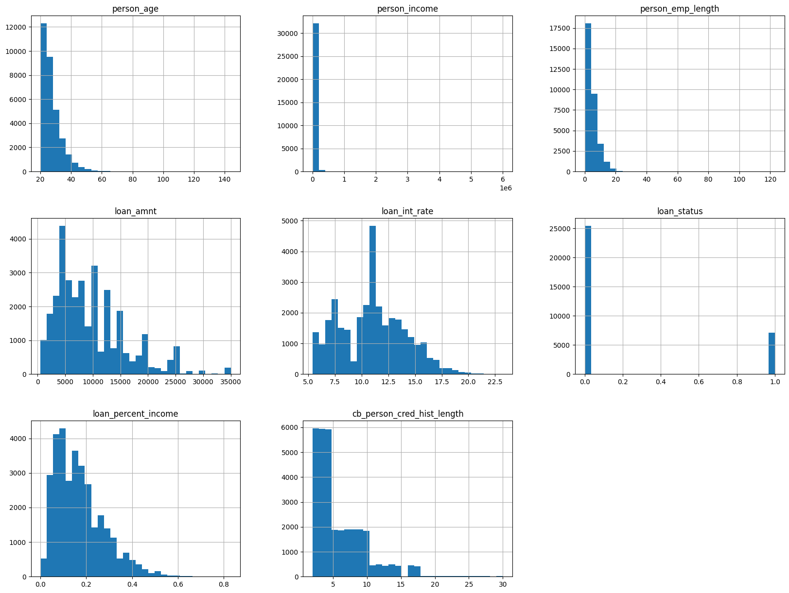

The distributions show that most numerical features are right-skewed, indicating the presence of high-value outliers in income and loan amount variables.

The target variable loan_status is imbalanced: 78.18% non-defaults (0) vs. 21.82% defaults (1).

|Target| %      |
|------|--------|
| 0	   | 78.18% |
| 1	   | 21.82% |


### Categorical Feature Analysis

Here’s a descriptive summary of the categorical feature distributions

#### 1. person_home_ownership
| person_home_ownership | percent |
|------------------------|----------|
| rent                   | 50.48%   |
| mortgage               | 41.26%   |
| own                    | 7.93%    |
| other                  | 0.33%    |

Most applicants rent or have mortgages, while home ownership is relatively rare, and “other” is negligible.


#### 2. loan_intent

| loan_intent        | percent |
|--------------------|----------|
| education          | 19.81%   |
| medical            | 18.63%   |
| venture            | 17.55%   |
| personal           | 16.95%   |
| debtconsolidation  | 15.99%   |
| homeimprovement    | 11.06%   |

* Top categories: `education` and `medical` loans are slightly higher than others.
* Moderate: `venture`, `personal`, and `debtconsolidation` have similar levels.
* Lowest: `homeimprovement` has the fewest applications.


#### 3. loan_grade

| loan_grade | percent |
|-------------|----------|
| a           | 33.08%   |
| b           | 32.08%   |
| c           | 19.82%   |
| d           | 11.13%   |
| e           | 2.96%    |
| f           | 0.74%    |
| g           | 0.20%    |

Most loans are high quality (A/B), indicating borrowers generally have good creditworthiness.
* Highest grades: `a` and `b` make up the majority of loans.
* Mid-range: `c` and `d` occur less frequently.
* Low grades: `e`, `f`, `g` are rare.


#### 4. cb_person_default_on_file

| cb_person_default_on_file | percent |
|----------------------------|----------|
| n                          | 82.37%   |
| y                          | 17.63%   |

Majority: `n` , most applicants have no prior defaults.
Minority: `y` , smaller group with past defaults.


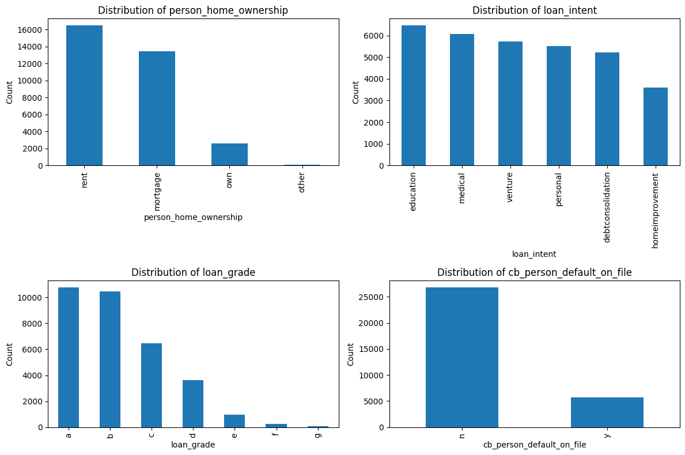


### Category vs. Target Analysis
To understand how categorical features relate to target loan_status, the following breakdown shows the proportion of loan default (`0`) vs. loan not default (`1`) for each category.

1. person_home_ownership vs loan_status

| person_home_ownership | paid (0) | default (1) |
| --------------------- | -------- | ----------- |
| mortgage              | 87.43%   | 12.57%      |
| other                 | 69.16%   | 30.84%      |
| own                   | 92.53%   | 7.47%       |
| rent                  | 68.43%   | 31.57%      |

Applicants who 'own' or have a 'mortgage' show the lowest default rates. In contrast, 'rent' and 'others' have significantly higher default probabilities, suggesting that home ownership stability correlates with credit reliability.

2. loan_intent vs loan_status

| loan_intent       | paid (0) | default (1) |
| ----------------- | -------- | ----------- |
| debtconsolidation | 71.41%   | 28.59%      |
| education         | 82.78%   | 17.22%      |
| homeimprovement   | 73.90%   | 26.10%      |
| medical           | 73.30%   | 26.70%      |
| personal          | 80.11%   | 19.89%      |
| venture           | 85.19%   | 14.81%      |

Loans taken for 'venture' and 'education' tend to perform better, with lower default rates. Conversely, 'debt consolidation' and 'medical' loans show higher default tendencies, possibly due to financial distress or unforeseen expenses.

3. loan_grade vs loan_status

| loan_grade | paid (0) | default (1) |
| ---------- | -------- | ----------- |
| a          | 90.04%   | 9.96%       |
| b          | 83.72%   | 16.28%      |
| c          | 79.27%   | 20.73%      |
| d          | 40.95%   | 59.05%      |
| e          | 35.58%   | 64.42%      |
| f          | 29.46%   | 70.54%      |
| g          | 1.56%    | 98.44%      |

A clear 'negative correlation' exists between 'loan_grade' and default rate. Lower-grade loans (D–G) have extremely high default rates. This confirms that 'loan_grade' is a strong predictor of repayment likelihood.


4. cb_person_default_on_file vs loan_status

| cb_person_default_on_file | paid (0) | default (1) |
| ------------------------- | -------- | ----------- |
| n                         | 81.61%   | 18.39%      |
| y                         | 62.19%   | 37.81%      |

Applicants with a prior 'default_on_file' are roughly higher posibility to default compared to those with clean records, making this one of the most influential categorical indicators.

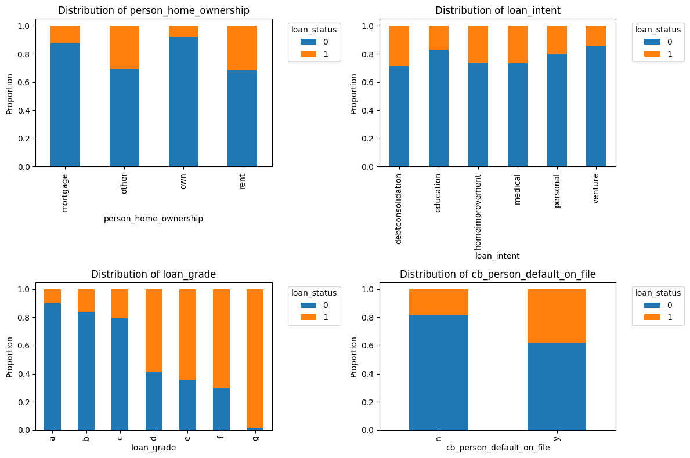


### Correlation Analysis

Correlation target column loan_status with other columns:
| Feature                     | Correlation |
|-----------------------------|-------------|
| loan_status                 | 1.000       |
| loan_percent_income         | 0.379       |
| loan_int_rate               | 0.319       |
| loan_amnt                   | 0.105       |
| cb_person_cred_hist_length  | -0.016      |
| person_age                  | -0.022      |
| person_emp_length           | -0.082      |
| person_income               | -0.144      |

loan_status shows positive correlations with loan_percent_income, loan_int_rate, and loan_amnt, indicating that higher income ratios, interest rates, and loan amounts are associated with a greater likelihood of default.

The rest columns have negative correlation. It means, increasing it will decrease probability to become default. Example, if person_income become higher, reduce the probability of default.

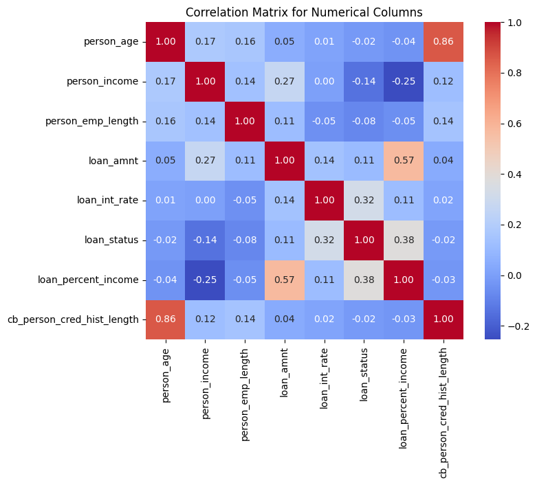


### Mutual Information Score

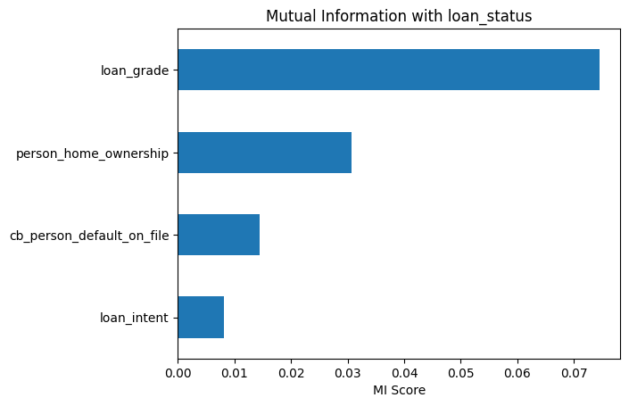

loan_grade has the highest Mutual Information (MI) score, confirming it as a strong predictor of loan default likelihood.


### Feature Engineering

Adding a new columns as new features, the new columns are:
- loan_to_income = loan_amnt / person_income
    Represents the proportion of the loan amount relative to the borrower’s income. A higher ratio may indicate higher financial burden and risk of default. 
    A ratio near or above 1 indicates that the loan amount equals or exceeds the borrower’s income, a potential risk factor for default.
- income_per_age = person_income / person_age
    Younger borrowers with higher incomes are generally less to default.
- credit_age_ratio = cb_person_cred_hist_length / person_age
    Measures how long the borrower has maintained credit relative to their age, indicating financial maturity and credit experience. If borrower age is mature and their credit history is short, the risk to default is high because they have less experience managing credit.
- emp_stability = person_emp_length / person_age
    Borrowers with longer employment history for their age are generally considered more financially stable.
- risk_index = loan_int_rate * loan_percent_income
    A high risk_index means the loan rate is expensive and takes up a large part of the borrower’s income, so the chance of missing payments is higher. Example, loan rate is 5% and borrower takes 50% of their income on loan payment, it indicates a high risk.


## 6. Model Training, Evaluation and Parameter Tuning

Since the target variable is binary, this project uses Logisitic Regression and Decision Tree Classifier.

The process covers model training, evaluation, parameter tuning, and threshold selection.

The big flows are:
1. Loading configuration
    Configuration file config.yaml contains:
    - Data folder location.
    - Data file name.
    - Random seed number.

2. Data preparation
    In this step, will do:
    - Loading data from csv file to dataframe.
    - Separate numerical and categorical columns.
    - Convert categorical value to lower case.
    - Fill missing value with median.
    - Split the data into train, val dan test with size 60%,20%,20%.

3. Model experiments
    In this step will do several experiments to find the best model configuration by using classification metric like accuracy, precision, recall, F1 Score, ROC AUC. Do parameter tuning, cross validation and finding optimal threshold.
    The details step :
    - Do some experiments by adding data transformation, scaling and add new features engineering.
    - Parameter tuning.
    - Cross validation.
    - Train final model.
    - Find optimal threshold.

To make the process easy, I create a function and use a pipeline to make it reusable:
- build_preprocessor
- build_lr_pipeline
- build_dt_pipeline
- evaluate_model


### 6.1. Logistic Regression
This section will do model training with Logistic Regression.
I do 5 experiments:
1. E1-1 as baseline.
    Do model training with default parameter value and without data preprocessing like transformation, scaling and features engineering.
2. E1-2 with class_weight balanced.
    Because the target column is imbalanced (78%:22%), I added class_weight to compensate for the imbalance.
3. E1-3 with class_weight balanced, log1p transformation.
    The numerical columns are right-skewed with long tails. To reduce the value range and normalize the distribution, I applied a log1p transformation.
4. E1-4 with class_weight balanced, log1p transformation, standard scaler.
    Applied StandardScaler to standardize the numerical features so that they have a mean of 0 and a standard deviation of 1.
5. E1-5 with class_weight balanced and log1p transformation, StandardScaler, Feature Engineering.
    Train model with adding new feature columns.


This is result of experiments 1-5:

| experiment | accuracy | precision | recall | f1_score | roc_auc |
|-----------:|---------:|----------:|-------:|---------:|--------:|
| E1-1       | 0.809    | 0.800     | 0.163  | 0.271    | 0.767   |
| E1-2       | 0.743    | 0.449     | 0.785  | 0.571    | 0.833   |
| E1-3       | 0.813    | 0.549     | 0.791  | 0.648    | 0.875   |
| E1-4       | 0.815    | 0.553     | 0.787  | 0.649    | 0.875   |
| E1-5       | 0.822    | 0.565     | 0.804  | 0.664    | 0.888   |

It seems from the metric, experiment E1-5 give the best score. So I select model from experiment E1-5.


#### Tuning Model Parameter

Based on the E1-5 configuration, I tuned the C over values [0.01, 0.1, 1, 10, 100, 400, 800, 1000, 1300, 1600].

This is the results:
| experiment   | accuracy | precision | recall | f1_score | roc_auc |
|--------------|----------|-----------|--------|----------|---------|
| E1-6_C_0.01  | 0.808    | 0.541     | 0.796  | 0.644    | 0.876   |
| E1-6_C_0.1   | 0.816    | 0.555     | 0.797  | 0.654    | 0.884   |
| E1-6_C_1     | 0.822    | 0.565     | 0.804  | 0.664    | 0.888   |
| E1-6_C_10    | 0.823    | 0.567     | 0.805  | 0.665    | 0.889   |
| E1-6_C_100   | 0.823    | 0.566     | 0.804  | 0.665    | 0.890   |
| E1-6_C_400   | 0.823    | 0.566     | 0.804  | 0.664    | 0.889   |
| E1-6_C_800   | 0.822    | 0.565     | 0.804  | 0.664    | 0.889   |
| E1-6_C_1000  | 0.822    | 0.565     | 0.804  | 0.663    | 0.889   |
| E1-6_C_1300  | 0.822    | 0.565     | 0.804  | 0.664    | 0.889   |
| E1-6_C_1600  | 0.822    | 0.565     | 0.804  | 0.663    | 0.889   |


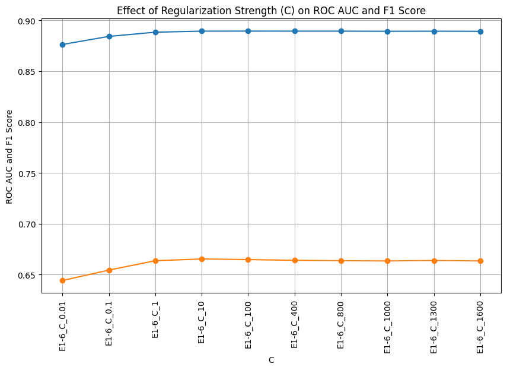

Choose C between 100 and 800, precision, recall, f1_score, roc auc, not change significant.
The choice is 400 or 800. I prefer use 400 because it's more generic than 800 (less C make model more generic, minimizing overfit). 


#### Cross Validation

For cross-validation, the training and validation datasets were combined, and StratifiedKFold (n_splits=5) was used to preserve the class ratio of loan_status across folds. The fold is split into 5.
For each folds, record the metrics ['accuracy', 'precision', 'recall', 'f1', 'roc_auc'].
And finally calculate mean and standard deviation.
It repeated do for different C [100, 300, 400, 500, 800]. 

Cross Validation, F1 Score Mean and Std for various C
| C Value | F1 Score Mean | F1 Score Std |
|---------|---------------|--------------|
| 100     | 0.661         | 0.007        |
| 300     | 0.661         | 0.007        |
| 400     | 0.662         | 0.006        |
| 500     | 0.661         | 0.006        |
| 800     | 0.662         | 0.006        |

Base on cross validation accross multiple C value, it seems C=400 is good choice.
Selected C=400 is a balance.


#### Finding Best Threshold

Train model with selected C=400.
Find best threshold by do looping threshold from 0 to 1 with step 0.01
The best threshold was 0.68, give a maximum F1 Score 0.708

| Metric      | Value   |
|-------------|---------|
| Threshold   | 0.680   |
| F1 Score    | 0.708   |
| Precision   | 0.714   |
| Recall      | 0.702   |


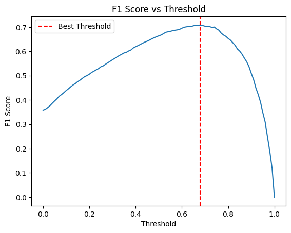


#### Final Model Training

Retrain model, with combine train and val dataset, and using C=400 and threshold 0.68.

Predict using test dataset, and give result:
| Metric    | Value      |
|-----------|------------|
| Threshold | 0.68       |
| F1 Score  | 0.693      |
| Precision | 0.699      |
| Recall    | 0.687      |


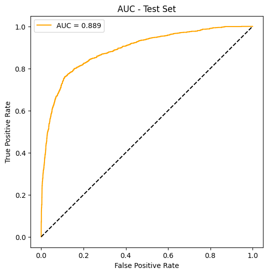


Detail all of this process can be view in [LogisticRegression Modelling](notebook/loan-approval-prediction-model01.ipynb)


### 6.2. Decision Tree Classifier

Same with Logistic Regression process above. 
This is result of experiments 1-5:

| Experiment | Accuracy | Precision | Recall | F1 Score | ROC AUC |
|:----------:|:--------:|:---------:|:------:|:--------:|:-------:|
| E2-1       | 0.885    | 0.727     | 0.758  | 0.742    | 0.839   |
| E2-2       | 0.883    | 0.727     | 0.746  | 0.736    | 0.834   |
| E2-3       | 0.885    | 0.732     | 0.745  | 0.738    | 0.834   |
| E2-4       | 0.885    | 0.732     | 0.745  | 0.738    | 0.834   |
| E2-5       | 0.890    | 0.751     | 0.740  | 0.745    | 0.836   |

From this experiments, it can be conclude:
Decision Tree performance remains nearly constant across preprocessing steps (E2-1 - E2-5).

The baseline model (E2-1) achieves the best recall (0.758) and highest ROC-AUC (0.839).
Class weight, log transformation, and scaling do not improve results, confirming the tree’s scale-invariant and nonlinear nature.

Using E2-1 as Decision Tree best model.


#### Tuning Model Parameter

* Find best max_depth
Finding best max_depth with try using max_depth = [1, 2, 3, 4, 5, 6, 7, 8, 9, 10]

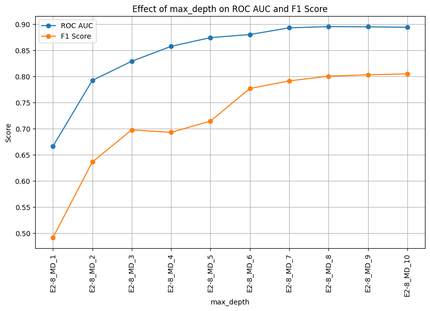

Both ROC AUC and F1 Score improve as max_depth increases from 1 to 8. Beyond that, performance plateaus, so max_depth=8 was chosen.
Increasing min_samples_leaf reduced both ROC AUC and F1 Score.
Therefore, max_depth = 8 was selected.


* Find best min_samples_leaf
    Finding best max_depth with try using min_samples_leaf = [1, 5, 10, 15, 20, 100, 200, 500]

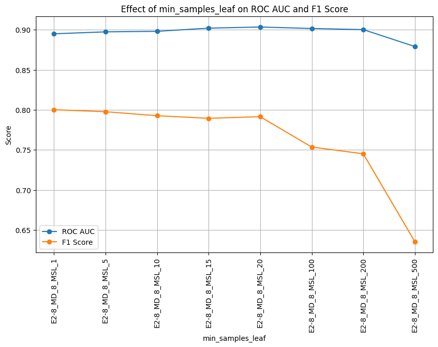

Increasing min_samples_leaf reduced both ROC AUC and F1 Score.
CTherefore, min_samples_leaf=5 was selected.

Comparing with Baseline E2-1:
- F1 score 0.742
- ROC AUC 0.839

Use max_depth=8 and min_samples_leaf=5:
- F1 score 0.797
- ROC AUC 0.897

It made an improvement by tuning parameters max_depth and min_samples_leaf.


#### Cross Validation

To do cross validation, the dataset must be combine between train and val first.
Using StratifiedKFold to maintain ratio between target loan_status. The fold is split into 5.
For each folds, record the metrics ['accuracy', 'precision', 'recall', 'f1', 'roc_auc'].
And finally calculate mean and standard deviation.

| Metric      | Mean   | Std    |
|-------------|--------|--------|
| Accuracy    | 0.927  | 0.003  |
| Precision   | 0.969  | 0.007  |
| Recall      | 0.690  | 0.012  |
| F1 Score    | 0.806  | 0.009  |
| ROC AUC     | 0.899  | 0.006  |

Base on cross validation it looks stable with small Std.


#### Features Importance

Using parameter max_depth = 8 and min_samples_leaf = 5

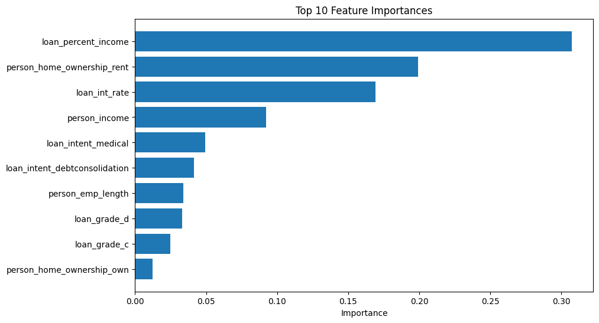

Top 3 features importance are:
- loan_percent_income
- person_home_ownership_rent
- loan_int_rate


#### Finding Best Threshold

Train model with max_depth = 8 and min_samples_leaf = 5.
Find best threshold by do looping threshold from 0 to 1 with step 0.01
The best threshold is 0.62, give a maximum F1 Score 0.798

| Metric      | Value  |
|-------------|--------|
| Threshold   | 0.62   |
| F1 Score    | 0.798  |
| Precision   | 0.969  |
| Recall      | 0.678  |

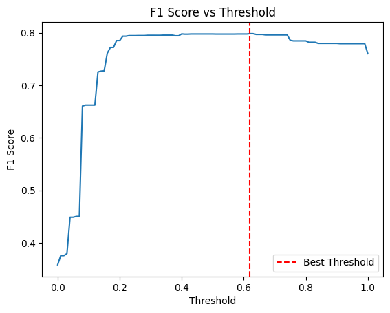


#### Final Model Training

Retrain model, with combine train and val dataset, using max_depth = 8 and min_samples_leaf = 5, and threshold 0.62.

Predict using test dataset, and give result:
| Metric    | Value      |
|-----------|------------|
| Threshold | 0.62       |
| F1 Score  | 0.81       |
| Precision | 0.976      |
| Recall    | 0.693      |


Detail all of this process can be view in [DecisionTree Modelling](notebook/loan-approval-prediction-model02.ipynb)


### 6.3. Choose Model
Comparing 2 models with val dataset:

| Metric    | Logistic Regression | Decision Tree |
|-----------|---------------------|---------------|
| Threshold | 0.68                | 0.62          |
| F1 Score  | 0.708               | 0.798         |
| Precision | 0.714               | 0.969         |
| Recall    | 0.702               | 0.678         |


Based on validation results, the Decision Tree Classifier achieved the highest F1 Score and Precision, making it the preferred final model.


## 7. Exporting Notebook to Script

After all experiments and model evaluation in the notebook, the next step is to convert the notebook into a Python script.
This script will make it easier to retrain the model.

The train.py includes all steps to train the final Decision Tree model using the best parameters found before.

Process flow:
1. Load configuration
   Read settings like data path, file name, and random seed from config.yaml.
   Using a config file makes it easier to change paths or parameters without editing the code.
   Make sure to check the value in config.yaml first (data_dir and filename). It must match with actual where data file and folder exist.

2. Define preprocessing and model pipeline
   * Function build_preprocessor() creates a ColumnTransformer to handle categorical and numerical columns.
     * Categorical columns use **OneHotEncoder**.
     * Numerical columns can use log transform or scaling if needed.
   * Function build_dt_pipeline() builds a complete pipeline that includes preprocessing and a DecisionTreeClassifier.

3. Load and prepare data
   * Load dataset.
   * Split columns into numerical and categorical.
   * Convert all categorical values to lowercase.
   * Fill missing numeric values using the median (better for data with outliers).
   * Separate the target column loan_status from features.

4. Split dataset
   Use train_test_split() to split data into training and test sets (80%, 20%).
   The split uses stratification to keep the target ratio balanced.

5. Build and train final model
   Build the pipeline with the best parameters: max_depth = 8 and min_samples_leaf = 5.
   Then fit the model using the training data.

6. Save the trained model
   After training, save the model to file final_model.pkl using joblib.
   This model file can later be loaded for prediction or used in an API.

### Run the Script
Run train.py to generate model file final_model.pkl
```
uv run train.py
```
After it runs, you will get a file named final_model.pkl in the current folder.


## 8. Deployment and Dependency Environment

### Deploy with FastApi
The file predict.py run the FastApi app. It exposes as POST endpoint at /predict using port 9696.
Both the input and output use Pydantic BaseModel to make sure the data format is correct.

The format input (JSON) is:
```
{
    "person_age": 23,
    "person_income": 115000,
    "person_home_ownership": "rent",
    "person_emp_length": 2.0,
    "loan_intent": "education",
    "loan_grade": "a",
    "loan_amnt": 35000,
    "loan_int_rate": 7.9,
    "loan_percent_income": 0.3,
    "cb_person_default_on_file": "n",
    "cb_person_cred_hist_length": 4
}
```

The response (JSON) is:
```
{
    'loan_probability': 0.037050231563947274, 
    'loan_status': 0
}
```

The predict.py script does the following:
* Initialize FastApi
* Load the model using joblib from model file final_model.pkl
* In the predict function:
    * Convert JSON input into a DataFrame.
    * Pass the DataFrame to predict_proba() to get the probability score.
    * Convert the probability into a final prediction (1 or 0) using the best threshold 0.62.
* Run on port 9696 and set host = 0.0.0.0 so the API can be accessed from other machines.

### Run predict.py
Run 
```
uv run predict.py
```
If everything is correct, you’ll see:
```
INFO:     Started server process [47033]
INFO:     Waiting for application startup.
INFO:     Application startup complete.
INFO:     Uvicorn running on http://0.0.0.0:9696 (Press CTRL+C to quit)
```

From local machine, the API is accessible at http://localhost:9696/predict
To access it from another machine, replace localhost with the machine's IP address.

Example predict loan status:
```
import requests

data = {
    "person_age": 23,
    "person_income": 115000,
    "person_home_ownership": "rent",
    "person_emp_length": 2.0,
    "loan_intent": "education",
    "loan_grade": "a",
    "loan_amnt": 35000,
    "loan_int_rate": 7.9,
    "loan_percent_income": 0.3,
    "cb_person_default_on_file": "n",
    "cb_person_cred_hist_length": 4
}

url = "http://localhost:9696/predict"
requests.post(url, json=data).json()
```
Response:
```
{'loan_probability': 0.037050231563947274, 'loan_status': 0}
```


## 9. Dockerize
This project already includes a Dockerfile, so you can easily deploy it using Docker.

### Build Docker Image
Run this command to build the Docker image:
```
docker build -t loan-approval-app .
```

### Run Docker Container:
Start the container:
```
docker run -p 9600:9696 loan-approval-app 
```
`-p 9600:9696` : the FastApi run at port 9696 inside the container and it exposed to port 9600 on the host.

From host machine, the API it can be accessed at http://localhost:9600/predict

You can check the running container in Docker Desktop:
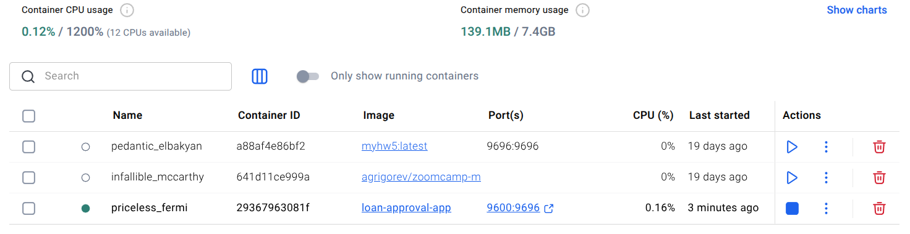

Another option is to test the API with Postman. Postman is tool for API development and testing.
Try sending a request using Postman:
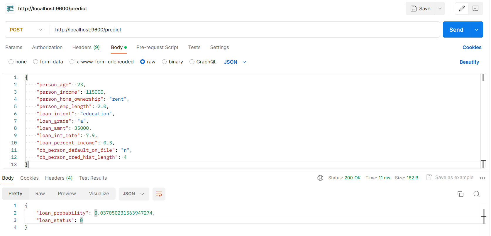


## 10. Deploy on Cloud

Install in server:
1. Clone from github:
    ```
    git clone https://github.com/mlpub/loan-approval-prediction
    cd loan-approval
    ```
2. Make sure uv is already installed:
    ```
    uv --version
    ```
    If uv not available, install it:
    ```
    pip install uv
    ```
3. Sync dependencies
    ```
    uv sync
    ```
4. Build model
    ```
    uv run train.py
    ```
5. Run
    ```
    uv run predict.py
    ```

In this case, I use my own server that is connected to public internet.
FastApi running on port 9696.
To make FastApi accessible from the internet, set up port forwarding in the router. By mapping the internal port 9696 to public port, in this case use 8080.

Instead of calling the API using an IP address (like x.x.x.x), use a domain name.
In the DNS management page, add domain/sub-domain and pointing it to the router's public IP address.

In this example I created a sub-domain mlzoomcamp2025.visianalitik.com and pointed it to my public ip address.

This is schema of server connection:
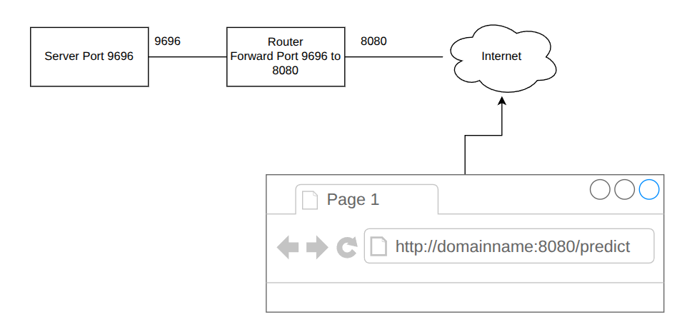


To test it, access the api from Postman:
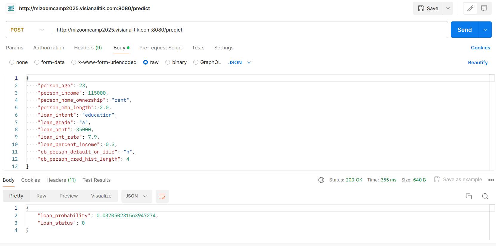


